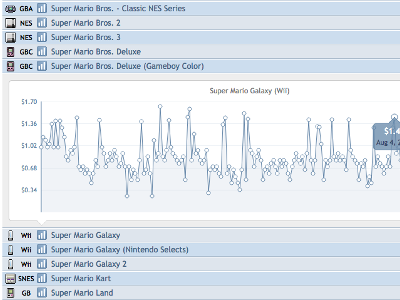
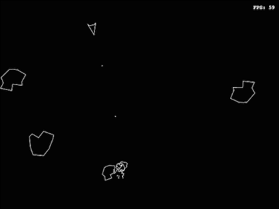
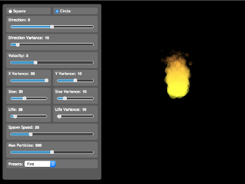

###[currency.js](https://github.com/scurker/currency.js)

currency.js is a lightweight javascript library for working with currency values. It was built to work around floating point issues in javascript. Everything is available on [github](https://github.com/scurker/currency.js) and on npm.

###[tivtrackr](http://tivtrackr.com)

tivtrackr is a project built to track trade-in values on Amazon. This was heavily inspired and helped by the folks at [cheapassgamer](http://cheapassgamer.com). It stores history over the past year so you can determine whether or not right now is a good time to trade-in your old games.

###[asteroids](asteroids/)

I wanted to play around with the capabilities of HTML5 and canvas so I was attempting to recreate asteroids using only HTML5 and javascript.

###[particles](particles/)

As part of the asteroids project (see above) I had a need to create particle effects in javascript. This demonstrates the different kinds of effects that can be generated via particles.